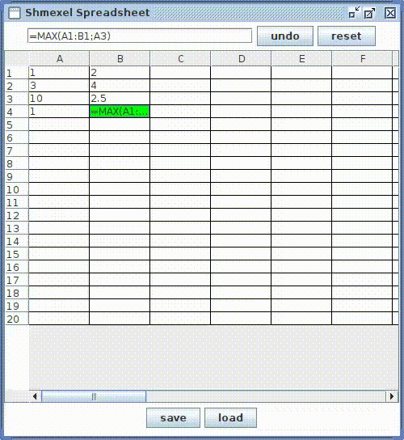

#Shmexel Spreadsheet
##Overview
A spreadsheet is a tool with table to store and analyze data. \
A cell may be represented by: 
* number value
* reference to another cell
* arithmetic expression
* operation on a range of cells
<!-- end of the list -->
A spreadsheet dynamically evaluates value in each cell. 
##Window view
Before the initial spreadsheet appears, the input pane for amount of rows and columns is displayed.

The main window contains a table, upper text field to get input from user and to \
display formula of selected cell, "undo", "reset", "save" and "load" buttons.  

Highlight cells in the sheet when selecting its reference in the input text pane.

Handle wrong input.

Reset and undo.

Save and load file.

##Supported functions and arithmetic operations
* Addition '+'
* Subtraction '-'
* Multiplication '*'
* Division '/'
* Power '^'
* Square root 'sqrt(NUM, [EXPR](#f1) or [REF](#f2))' 
* SUM(REF1:REF2;REF3;REF4:REF5;...)
* AVERAGE(REF1:REF2;REF3;REF4:REF5;...)
* MIN(REF1:REF2;REF3;REF4:REF5;...)
* MAX(REF1:REF2;REF3;REF4:REF5;...)

##Run and build
Clone repository

1.  Expression is an equals sign, followed by numbers, references and allowed operators, i.e. =2+2 or =A1*4.
2.  Reference a latin letter, followed by number.

