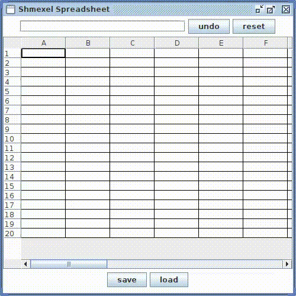

# Shmexel Spreadsheet
## Overview
A spreadsheet is a tool with table to store and analyze data. \
A cell may be represented by: 
* number value
* reference to another cell
* arithmetic expression
* operation on a range of cells
<!-- end of the list -->
A spreadsheet dynamically evaluates value in each cell. 
## Window view and functionality
Before the initial spreadsheet appears, the input pane for amount of rows and columns is displayed. \
 \
The main window contains a table, upper text field to get input from user and to \
display formula of selected cell, as well as the following buttons:
* undo
* reset
* save
* load
<!-- end of the list -->
 \
Highlight cells in the sheet when selecting its reference in the input text pane. \
 \
Handle wrong input. \
 \
Reset and undo. \
 \
Save and load file. \

## Supported functions and arithmetic operations
* Addition '+'
* Subtraction '-'
* Multiplication '*'
* Division '/'
* Power '^'
* Square root 'sqrt(NUM, [EXPR](#f1) or [REF](#f2))'
* SUM(REF1:REF2;REF3;REF4:REF5;...)
* AVERAGE(REF1:REF2;REF3;REF4:REF5;...)
* MIN(REF1:REF2;REF3;REF4:REF5;...)
* MAX(REF1:REF2;REF3;REF4:REF5;...)
<!-- end of the list -->

## Run and build
Clone repository and run a Shmexel_Spreadsheet-1.0.jar file.

### Footnotes
1.  Expression is an equals sign, followed by numbers, references and allowed operators, i.e. =2+2 or =A1*4.
2.  Reference is latin letter(s), followed by number.
